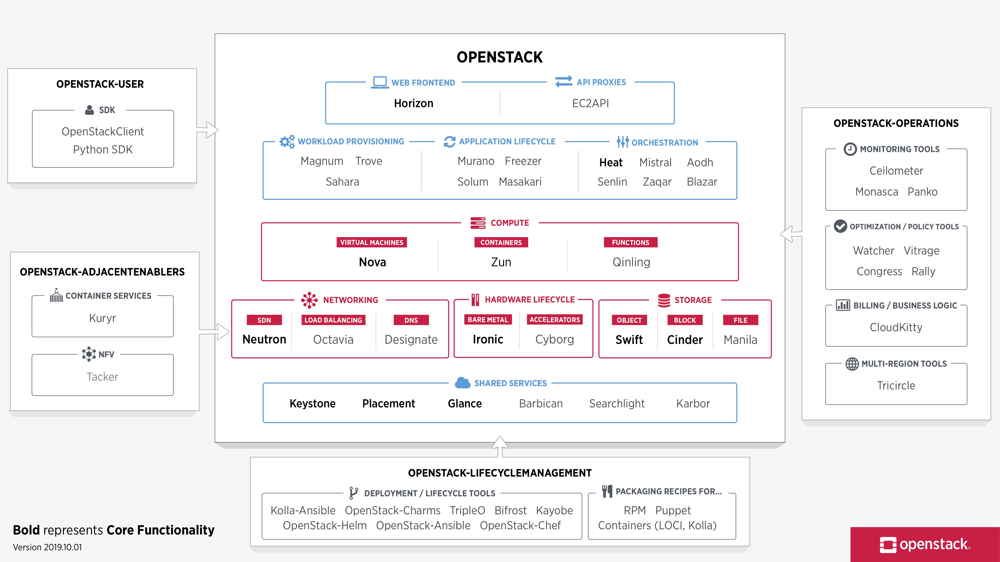
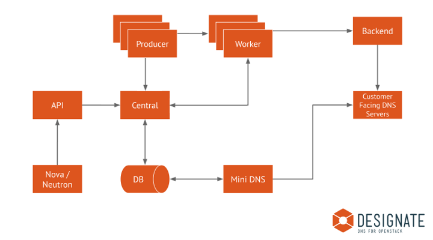
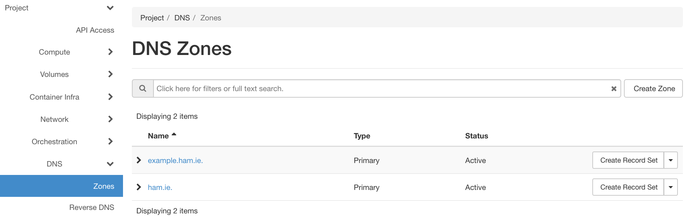
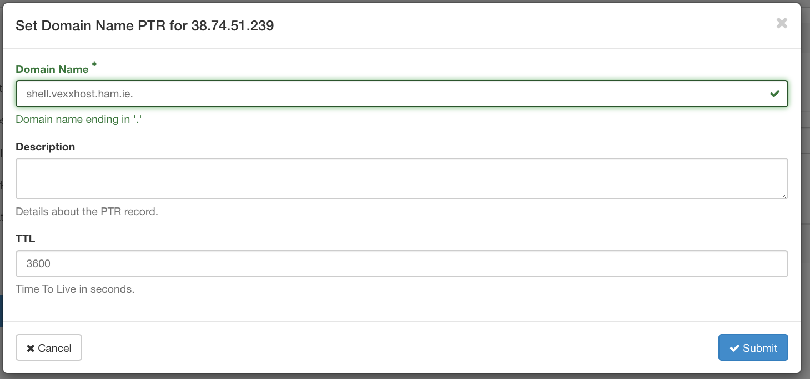
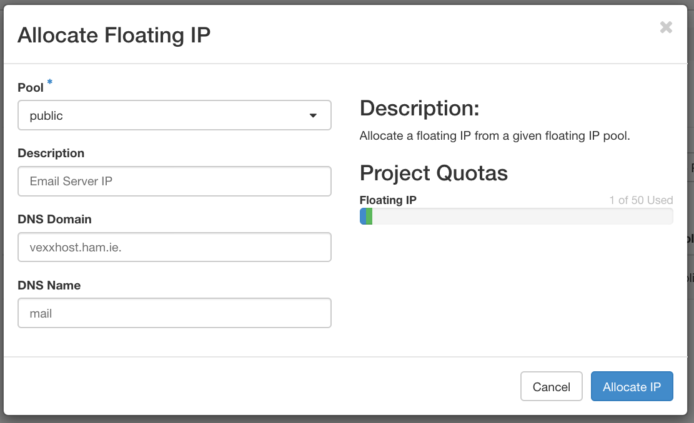

slidenumbers: true
footer:  https://gra.ham.ie | @grahamhayes
autoscale: true

## DNS in OpenStack
### What is the OpenStack DNS API?
<br>


---


# Graham Hayes

- Principal Engineer @  Azure
- Ex Designate PTL
- OpenStack TC
<br>
<br>

https://gra.ham.ie

@grahamhayes

gr@ham.ie

---
[.hide-footer]
[.slidenumbers: false]



---

# Core Design

- Multi tenant
- Use the same authz/authn schemes as other projects
- Allow deployers to choose data planes they know
- API first design
- Highly Available

---

# Designate

- Plugable architecture
    - API Endpoints
    - DNS Servers
    - Notifications
    - Database / State storage
    - Quota Management
    - Policy / Access Control

---

# DNS Servers


- PowerDNS
- BIND
- Designate
- InfoBlox
- more... [^1]

[^1]: https://docs.openstack.org/designate/latest/admin/support-matrix.html

---
[.background-color: #FFFFFFF]
[.hide-footer]
[.slidenumbers: false]



^ Cover the following:
^ DNS Servers

---

# Integrations
## OpenStack

- OpenStack Dashboard
- OpenStack CLI
- OpenStack Heat (Orchestration Service)
- OpenStack Neutron (Networking Service)
- Designate Sink (read notifications from AMQP queue)

---

# Integrations
## External

- Ansible
- Terraform
- Kubernetes External DNS
- certbot
- SDKs

---

# Usage

```console

➜ openstack --os-cloud vexxhost zone list
+--------------------------------------+---------+---------+------------+--------+--------+
| id                                   | name    | type    |     serial | status | action |
+--------------------------------------+---------+---------+------------+--------+--------+
| b0ba5b21-f734-42ba-8bfd-ae59f9034e76 | ham.ie. | PRIMARY | 1557767331 | ACTIVE | NONE   |
+--------------------------------------+---------+---------+------------+--------+--------+
```

---
# Usage

```console
openstack --os-cloud vexxhost zone create --email gr@ham.ie example.ham.ie.
+----------------+--------------------------------------+
| Field          | Value                                |
+----------------+--------------------------------------+
| action         | CREATE                               |
| attributes     |                                      |
| created_at     | 2020-01-29T17:32:39.000000           |
| description    | None                                 |
| email          | gr@ham.ie                            |
| id             | b0433c37-4ea6-48ff-b8c9-c012ab002787 |
| masters        |                                      |
| name           | example.ham.ie.                      |
| pool_id        | 794ccc2c-d751-44fe-b57f-8894c9f5c842 |
| project_id     | cd72fafe6de54029afc40f53370a277e     |
| serial         | 1580319159                           |
| status         | PENDING                              |
| transferred_at | None                                 |
| ttl            | 3600                                 |
| type           | PRIMARY                              |
| updated_at     | None                                 |
| version        | 1                                    |
+----------------+--------------------------------------+
```

---

```http
GET /v2/zones HTTP/1.1
Host: dns.vexxhost.net

HTTP/1.1 200 OK

{
    "links": {
        "self": "http://dns.vexxhost.net/v2/zones"
    },
    "metadata": {
        "total_count": 1
    },
    "zones": [
        {
            "action": "NONE",
            "attributes": {},
            "created_at": "2019-05-13T17:08:51.000000",
            "description": null,
            "email": "gr@ham.ie",
            "id": "b0ba5b21-f734-42ba-8bfd-ae59f9034e76",
            "links": {
                "self": "http://dns.vexxhost.net/v2/zones/b0ba5b21-f734-42ba-8bfd-ae59f9034e76"
            },
            "masters": [],
            "name": "ham.ie.",
            "pool_id": "794ccc2c-d751-44fe-b57f-8894c9f5c842",
            "project_id": "cd72fafe6de54029afc40f53370a277e",
            "serial": 1557767331,
            "status": "ACTIVE",
            "transferred_at": null,
            "ttl": 3600,
            "type": "PRIMARY",
            "updated_at": "2019-05-13T17:09:28.000000",
            "version": 2
        }
    ]
}
```

---

```http
GET /v2/zones/b0ba5b21-f734-42ba-8bfd-ae59f9034e76/recordsets/1d19c3ca-1f2a-4bd7-8dd3-b3faeeb1d994 HTTP/1.1
Host: dns.vexxhost.net

HTTP/1.1 200 OK

{
    "action": "NONE",
    "created_at": "2019-05-13T17:08:52.000000",
    "description": null,
    "id": "1d19c3ca-1f2a-4bd7-8dd3-b3faeeb1d994",
    "links": {
        "self": "http://dns.vexxhost.net/v2/zones/b0ba5b21-f734-42ba-8bfd-ae59f9034e76/recordsets/1d19c3ca-1f2a-4bd7-8dd3-b3faeeb1d994"
    },
    "name": "ham.ie.",
    "project_id": "cd72fafe6de54029afc40f53370a277e",
    "records": [
        "ns1.vexxhost.net.",
        "ns2.vexxhost.net."
    ],
    "status": "ACTIVE",
    "ttl": null,
    "type": "NS",
    "updated_at": null,
    "version": 1,
    "zone_id": "b0ba5b21-f734-42ba-8bfd-ae59f9034e76",
    "zone_name": "ham.ie."
}
```
---



---



---



---

# Why use Designate?

- Running a cloud
- Multi tenant DNS API
- Can re-use existing DNS infrastructure

---

# Links

- https://docs.openstack.org/designate/latest/
- https://opendev.org/openstack/designate
- IRC: `#openstack-dns` on Freenode
- openstack-discuss@lists.openstack.org